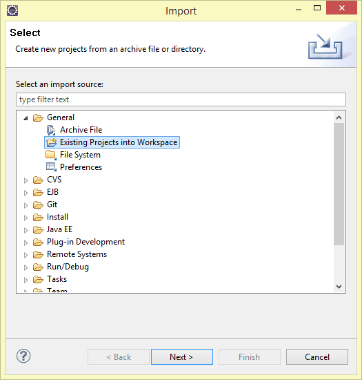
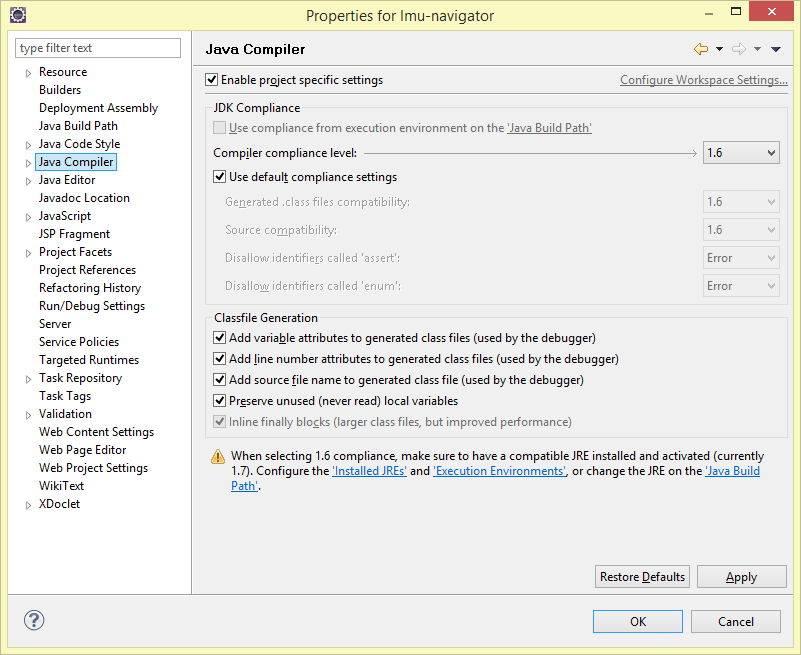
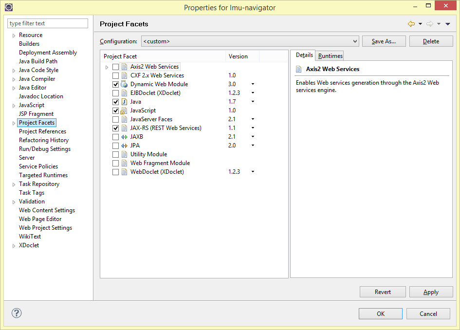
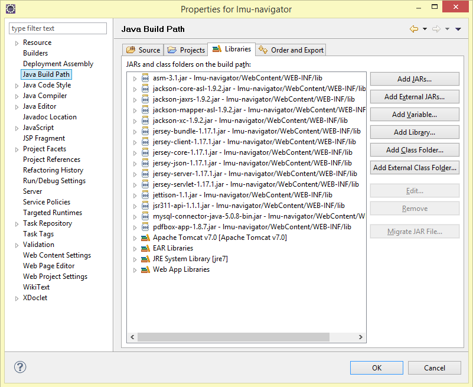
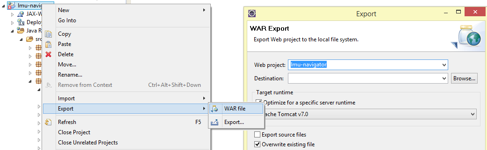

# Server Dokumentation

__Repository: __ https://github.com/lmu-navigator/server

Ausgangsbasis für den Server war die Praxisphase aus dem Praktikum [Mobile und Verteilte Systeme](http://www.mobile.ifi.uni-muenchen.de/studium_lehre/verg_semester/ws1314/msp/index.html) im Wintersemester 2013/14. Dort haben wir einen RESTful Web Service mit Hilfe von Java, [Tomcat](http://tomcat.apache.org/), [Jersey](https://jersey.java.net/) (JAX-RS) und [MySQL](http://www.mysql.com/) aufgesetzt, hier die [Folien zur damaligen Übung](http://www.mobile.ifi.uni-muenchen.de/studium_lehre/verg_semester/ws1314/msp/05-rest.pdf).

Falls noch Zugriff auf alte Entwicklungsstände benötigt wird, kann man die alten Repositories über folgende Links erreichen (man benötigt jedoch einen [GitLab](https://gitlab.cip.ifi.lmu.de/)-Zugang): Repository aus dem [Wintersemester 2013/14](https://gitlab.cip.ifi.lmu.de/loewe/lmu-navi) und aus dem darausfolgenden [Sommersemester 2014](https://gitlab.cip.ifi.lmu.de/zieglerl/lmu-navigator/).

__Übersicht:__

* Installation
* Architektur (Struktur)
* REST API
* Deployment

## Installation

Installation der Arbeitsumgebung, welche von 2013 bis Anfang 2015 verwendet wurde.


* Tomcat
* MySQL
* Apache
* Eclipse


### Tomcat

* Tomcat Version: 7.0.42.0
* JVM Version: 1.7.0_21-b11
* OS Name: Windows 8, Version: 6.2, Architecture: amd64

### MySQL

Beim MySQL Server (Version 5.0.11) wurden keine individuellen Anpassungen vorgenommen. Wir haben lokal mit der MySQL-Instanz gearbeitet, welche mit [XAMPP](https://www.apachefriends.org/de/index.html) mitgeliefert wurde.

Als Administrationsoberfläche haben wir [PhpMyAdmin](http://www.phpmyadmin.net/) verwendet, welches ebenfalls mit XAMPP mitgeliefert wird.

### Apache

[Apache](http://httpd.apache.org/) haben wir für PhpMyAdmin und zum Hosten von allen statischen Dateien (über Port 80) verwendet, da ein Tomcat Servlet mit mehreren 100 MB auf Windows zu Problemen und Abstürzen führt.

### XAMPP

Die Installation von [XAMPP](https://www.apachefriends.org/de/index.html) ist optional. Sie erleichtert vor allem bei Windows Geräten die Installation von Apache, PHP, MySQL und PhpMyAdmin.


### Eclipse

[Eclipse Java EE](https://eclipse.org/downloads/) IDE for Web Developers<br> (Juno Service Release 2, Build id: 20130225-0426)
)

Benötigte Plugins: [Eclipse Web Tools Platform](http://www.eclipse.org/webtools/)

Import des Projektes

* GitHub Repo klonen

* Eclipse installieren (Version siehe oben)

* Projekt importieren


* General > Existing Projects into Workspace


* Projekt hinzufügen


__Konfiguration von Eclipse__

Sollte es zu Problemen bei dem Ausführen des Servlets kommen, kann es u.a. daran liegen, dass Eclipse das Projekt noch nicht als Dynamic Web Project erkennt. Hierfür müssen u.a. folgende Projekt-Einstellungen vorgenommen sein:

* Java Version 1.6, da auf dem aktuellen Server (http://141.84.213.246:8080) nur Java 1.6 installiert ist.


* Sicherstellen, dass die Facets _Dynamic Web Module_ und _JAXB_ ausgewählt sind.


* Und hier noch eine Übersicht der verwendeten JARs


* Sicherstellen, dass Tomcat auch als Runtime Environment zu Eclipse hinzugefügt wurde.


## Architektur

* Erklärung des Datenmodells
* Erklärung der Module
* Wie die Module und Klassen zusammenhängen
* Wie man auf den Server zugreifen kann


### Modell

Das Modell ist im Package `de.lmu.navigator.server.model` abgelegt. Für uns wichtig sind folgende Klassen: (mit Mapping von unserem Datenmodell zu den CSV-Dateien von der LMU)

    City.java            <->    01_Stadt.csv
    Street.java          <->    02_Strasse.csv
    Building.java        <->    03_Bauwerk.csv
    BuildingPart.java    <->    04_BauteilHaus.csv
    Floor.java           <->    05_Geschoss.csv
    Room.java            <->    06_Raum.csv

Zwischen den jeweiligen Modell-Hierarchien besteht eine 1-zu-N-Beziehung (von City zu Street, von Street zu Building, usw).


### Packages

Der Java Tomcat-Server besteht aus folgenden fünf Packages:

    de.lmu.navigator.server           (REST API / Jersey)
    de.lmu.navigator.server.data      (Logik für Raumpositionierung)
    de.lmu.navigator.server.database  (MySQL Integration)
    de.lmu.navigator.server.model     (Datenmodell)
    de.lmu.navigator.server.upload    (CSV Importer)

#### Modell-Package

Das gerade beschriebene Datenmodell liegt im Package `de.lmu.navigator.server.model` vor. Dort liegen neben den oben beschriebenen Objekttypen noch ein paar weitere Klassen bereit:

    Settings.java                 (Pfade wo PNGs/PDFs im Dateisystem liegen)
    Version.java                  (Fortlaufende Numerierung für Versionskontrolle)

Zum Zeitpunkt des Praktikums haben wir auch noch __Wegegraphen__ für das Indoor-Routing gespeichert, welcher in der aktuellen Version der App und des Servers gestrichen wurde. Für diesen Wegegraphen hatten wir folgende Klassen angelegt:

    RoutingNode.java              (Knoten)
    RoutingEdge.java              (Kante)
    RoutingFloorConnection.java   (Verbindet stockwerkübergreifend Knoten)
    RoutingRoomConnection.java    (Verbindet Räume mit Knoten)


#### Hauptmodul

Das Hauptmodul `de.lmu.navigator.server` definiert die REST API und stellt somit den Entry Point für die Server-Anwendung dar. Umgesetzt wurde dieser Teil mit der [Java API for RESTful Services (JAX-RS)](https://jax-rs-spec.java.net/) (Package javax.ws.rs). Für nähere Informationen zu Jersey (JAX-RS) siehe: https://jersey.java.net/documentation/latest/index.html

Das Mapping von REST URI zu den Getter und Setter Funktionen funktioniert recht intuitiv über Annotationen direkt im Code. An der Klasse selbst legt man fest, welches

``` java
@Path("/rooms")
public class Rooms {

  @GET
  @Produces("application/json")
  public ArrayList<Room> getRoomsByRange(
    @DefaultValue("") @QueryParam("code") String roomCode,
    @DefaultValue("") @QueryParam("floor") String floorCode)
    throws Exception {
      ...
  }
}

```

Für die Klassen XX bis XX ist der Aufbau analog.

Als Datenbank-Anbindung haben wir jeweils die Klassen CityMySQL - RoomMySQL angelegt.


## Datenbank

Als Datenbank haben wir uns für [MySQL](mysql.com) und als Administrationsoberfläche für [PhpMyAdmin](http://www.phpmyadmin.net/) entschieden, da hierfür die meisten Vorkenntnisse vorhanden waren.

Die Architektur der Datenbank ist angelehnt an die Struktur der CSV-Dateien, welche wir für den Import vom [Referat IV.1](http://www.uni-muenchen.de/einrichtungen/zuv/uebersicht/dez_iv/ref_iv1/index.html) der LMU München bekommen.

Ein vollständiger MySQL-Dump der Datenbank kann im privaten GitHub-Repository gefunden werden: https://github.com/lmu-navigator/data/tree/master/sql

Zur Veranschaulichung findet ihr hier die Struktur der MySQL Tabellen (Stand Februar 2015). Der aktuelle Stand wird

<!--
``` sql
CREATE TABLE IF NOT EXISTS `1_city` (
  `id` int(11) NOT NULL AUTO_INCREMENT,
  `Code` text NOT NULL,
  `Name` text NOT NULL,
  PRIMARY KEY (`id`)
) ENGINE=InnoDB  DEFAULT CHARSET=utf8;

CREATE TABLE IF NOT EXISTS `2_street` (
  `id` int(11) NOT NULL AUTO_INCREMENT,
  `Code` text NOT NULL,
  `CityCode` text NOT NULL,
  `Name` text NOT NULL,
  PRIMARY KEY (`id`)
) ENGINE=InnoDB  DEFAULT CHARSET=utf8;

CREATE TABLE IF NOT EXISTS `3_building` (
  `id` int(11) NOT NULL AUTO_INCREMENT,
  `Code` text NOT NULL,
  `StreetCode` text NOT NULL,
  `DisplayName` text NOT NULL,
  PRIMARY KEY (`id`)
) ENGINE=InnoDB  DEFAULT CHARSET=utf8;

CREATE TABLE IF NOT EXISTS `3_building_position` (
  `Code` varchar(16) NOT NULL,
  `CoordLat` double DEFAULT NULL,
  `CoordLong` double DEFAULT NULL,
  KEY `Code` (`Code`)
) ENGINE=InnoDB DEFAULT CHARSET=utf8;

CREATE TABLE IF NOT EXISTS `4_building_part` (
  `id` int(11) NOT NULL AUTO_INCREMENT,
  `Code` text NOT NULL,
  `BuildingCode` text NOT NULL,
  `Address` text NOT NULL,
  `hidden` int(1) NOT NULL DEFAULT '0',
  PRIMARY KEY (`id`)
) ENGINE=InnoDB  DEFAULT CHARSET=utf8;

CREATE TABLE IF NOT EXISTS `5_floor` (
  `id` int(11) NOT NULL AUTO_INCREMENT,
  `Code` text NOT NULL,
  `BuildingPartCode` text NOT NULL,
  `FloorLevel` text NOT NULL,
  `Name` text NOT NULL,
  `MapUri` text NOT NULL,
  `MapSizeX` int(11) NOT NULL,
  `MapSizeY` int(11) NOT NULL,
  `hidden` int(1) NOT NULL DEFAULT '0',
  PRIMARY KEY (`id`)
) ENGINE=InnoDB  DEFAULT CHARSET=utf8;

CREATE TABLE IF NOT EXISTS `6_room` (
  `id` int(11) NOT NULL AUTO_INCREMENT,
  `Code` text NOT NULL,
  `Name` text NOT NULL,
  `FloorCode` text NOT NULL,
  `PosX` double NOT NULL,
  `PosY` double NOT NULL,
  `hidden` int(1) NOT NULL DEFAULT '0',
  PRIMARY KEY (`id`)
) ENGINE=InnoDB  DEFAULT CHARSET=utf8;

CREATE TABLE IF NOT EXISTS `settings` (
  `parameter` varchar(15) NOT NULL,
  `value` text NOT NULL,
  PRIMARY KEY (`parameter`),
  UNIQUE KEY `param` (`parameter`)
) ENGINE=InnoDB DEFAULT CHARSET=utf8;

CREATE TABLE IF NOT EXISTS `version` (
  `version` int(11) NOT NULL AUTO_INCREMENT,
  `timestamp` int(11) NOT NULL,
  `log` text NOT NULL,
  PRIMARY KEY (`version`)
) ENGINE=InnoDB  DEFAULT CHARSET=utf8;

```


Folgende Tabellen sind optional. Diese Tabellen waren für die Indoor-Routing Funktionalität unseres Prototypen benötigt.

``` sql
CREATE TABLE IF NOT EXISTS `routing_edges` (
  `id` int(11) NOT NULL AUTO_INCREMENT,
  `FloorId` int(11) NOT NULL,
  `Source` int(11) NOT NULL,
  `Target` int(11) NOT NULL,
  `Weight` int(11) NOT NULL,
  PRIMARY KEY (`id`)
) ENGINE=InnoDB DEFAULT CHARSET=utf8;

CREATE TABLE IF NOT EXISTS `routing_floor_connections` (
  `id` int(11) NOT NULL AUTO_INCREMENT,
  `BuildingId` int(11) NOT NULL,
  `Source` int(11) NOT NULL,
  `Target` int(11) NOT NULL,
  `Type` text NOT NULL,
  PRIMARY KEY (`id`)
) ENGINE=InnoDB DEFAULT CHARSET=utf8;

CREATE TABLE IF NOT EXISTS `routing_nodes` (
  `id` int(11) NOT NULL AUTO_INCREMENT,
  `FloorId` int(11) NOT NULL,
  `PosX` double DEFAULT NULL,
  `PosY` double DEFAULT NULL,
  `Entrance` tinyint(1) NOT NULL DEFAULT '0',
  PRIMARY KEY (`id`)
) ENGINE=InnoDB DEFAULT CHARSET=utf8;

CREATE TABLE IF NOT EXISTS `routing_room_connections` (
  `id` int(11) NOT NULL AUTO_INCREMENT,
  `Node` int(11) NOT NULL,
  `Room` int(11) NOT NULL,
  PRIMARY KEY (`id`)
) ENGINE=InnoDB DEFAULT CHARSET=utf8;
```
-->


## REST API

Im folgenden wird die REST Schnittstelle des Tomcat Servers beschrieben. Aktuell kann die REST-API für den Server unter folgender Adresse aufgerufen werden: http://141.84.213.246:8080/lmu-navigator/rest/

Für den Produktiveinsatz arbeiten wir vorerst mit statischen JSON-Dateien. Zum einen da sich der Datenbestand meist nur einmal pro Semester verändert, zum anderen da wir dadurch auf Server der LMU München zurückgreifen können. Die neu generierten JSON-Dateien werden bei jeder Verändernug (Veränderung der Versionsnummer `/rest/version`) erneut am Mobilgerät eingelesen. Die Aktualisierung ist einmal pro Semester in Rücksprache mit den Referaten geplant.

Nützliche Links für die Entwicklung:
* http://stackoverflow.com/q/630453/1402076 (PUT vs POST)
* http://goo.gl/C3FPyt (Advanced Rest Client / Chrome Plugin)

### Statische JSON Dateien

Alle für die App relevanten Raum- und Gebäudedaten liegen auf folgendem Server der LMU vor:

    TODO StaticServer URI

asdf

    1_city.json
    2_street.json
    3_building.json
    3_building_position.json
    4_building_part.json
    5_floor.json
    6_room.json
    version.json

Hier werden neben den JSON Dateien auch die Gebäudepläne im PNG- und PDF-Format gehosted. Ansprechpartner für diesen Server ist das [Referat für Internetdienste](http://www.internetdienste.verwaltung.uni-muenchen.de/funktionen/kontakt/index.html).


### REST Funktionalität des Tomcat Servers

__GET /version__
* liefert die aktuelle Version der Datenbasis<br>
  {"version":7,"timestamp":1409688383}


#### /cities

* __GET	/cities__
  returns a list of all cities with LMU buildings


#### /streets

#### /buildings

#### /buildingparts

#### /floors

* __GET /floors/{floorCode}__
  returns a single floor for the requested floor ID / code

* __GET /floors/{floorCode}/bordering__
  returns all floors associated to the same mapUri (PDF file), excluding the floor itself, required for buildings like the main building (Geschwister-Scholl-Platz)

* __GET /floors__
  returns all available floors from the database

* __GET /floors?code={floorCode}&buildingpart={buildingPartCode}__
  returns all available floors from the database

#### /rooms

__Besonderheiten:__ Es werden nur Räume als JSON ausgegeben, die eine gültige Position haben (PosX != 0 + PosY != 0) und sichtbar sind (hidden == 0). Nicht positionierte und deaktivierte Räume werden somit nicht zur App übertragen.


## Deployment des Servers

Schritt für Schritt-Anleitung:

* Zuerst in `de.lmu.navigator.server.database.Database.java` die Flag `PRODUCTION_SERVER` auf `true` setzen, und nach dem Exportieren der WAR file wieder zurück auf `false` (=development environment).

* Eclipse-Projekt als WAR-File exportieren


* WinSCP starten und am Server einloggen

* Die WAR-Datei hochladen und nun folgende Kommandos ausführen

    sudo rm webapps/lmu-navigator.war
    sudo rm webapps/lmu-navigator/ -r
    sudo mv lmu-navigator.war webapps/

Der Pfad für `webapps` variiert von System zu System. Auf dem aktuellen System weist er auf `/var/lib/tomcat7/webapps`.

Bei Problemen mit Tomcat auf dem [141.84.213.246](http://141.84.213.246:8080/)-Server am besten mal in das [GitLab-Wiki](https://gitlab.cip.ifi.lmu.de/zieglerl/lmu-navigator/wikis/tomcat-server) schauen.


## Room Canvas

Manually updating the room positions of on the RoomsOverview servlet, e.g.: http://localhost:8080/lmu-navigator/data/rooms?floor=g650301

Features:
* Manual positioning of rooms cross iFrames
* Press the ESC key to abort the manual positioning and scroll back to top
* Right click: Pan
* Left click: select new position

# Future Work

Auf den MEAN-Stack migrieren, Node.js für das Backend verwenden und Angular.js, Ember.js oder Backbone.js für das Frontend.
